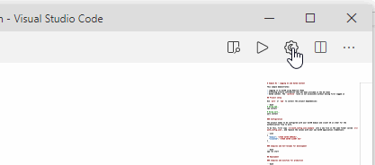

# light-dark-toggle README

light / dark theme toggle that lives on the top right corner of your editor.

As a Dark theme user, I had a pet peeve where previewing markdown files had to be in Light Theme, otherwise the colors don't match the places where they were seen (e.g. websites that preview markdown like Github, or VSCode Marketplace)

That, and plus copy pasting from markdown preview to a WYSIWYG editor like Jira also copies their color and background color! **_the horror!_**

## how to use

click on toggle. rejoice. click on toggle again. rejoice once more.

## how to customize

set your **Preferred Dark Color Theme** and **Preferred Light Color Theme** under your user settings and away we go!

## how to setup for your color themes

1. User Settings: `Ctrl + Shift + P`
2. Type `color theme` in your searchbar
3. pick your preffered light and dark themes.

## Attributions

Icons made by <a href="https://www.flaticon.com/authors/pixel-perfect" title="Pixel perfect">Pixel perfect</a> from <a href="https://www.flaticon.com/" title="Flaticon"> www.flaticon.com</a>
